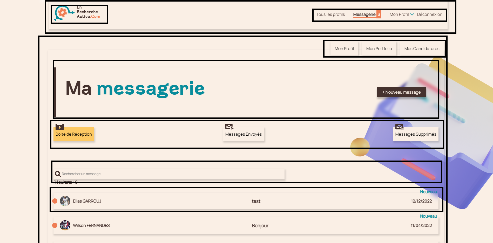

# UI Interface

# UI Layer

---

- Facebook dit, on ne touche plus au DOM , on crée un Dom virtuel
- Chaque balise est un composant React
- Découpage en composant ré-utilisable à l’interieur du projet ou dans d’autres projets
- Chaque composant aura ça logique , son état ses propriété

