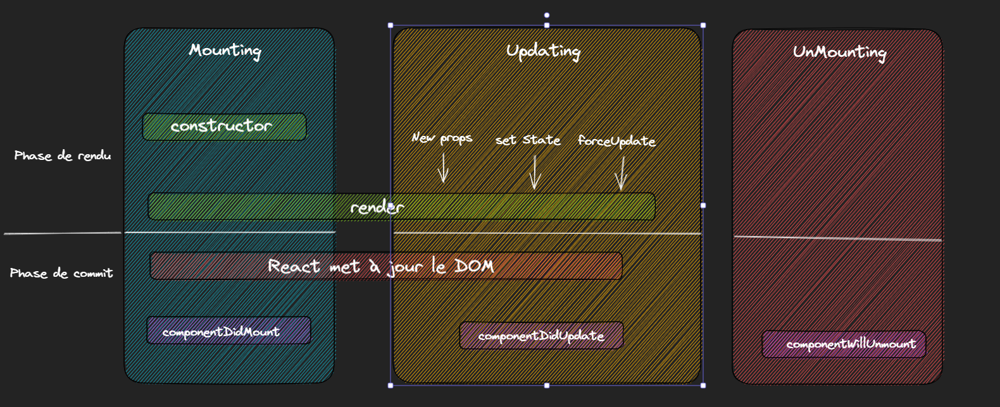

# Cycle de vie

# Cycle de vie

---

Les cycles de vie en React sont des méthodes spécifiques qui sont appelées à des moments déterminés de la vie d'un composant React :

1. `Mounting` : lorsque le composant est créé et inséré dans le DOM pour la première fois, la méthode `constructor` est appelée, suivie de la méthode `render`.
2. `Updating` : lorsque les `props` ou l'état du composant sont mis à jour, la méthode `shouldComponentUpdate()` peut être appelée pour déterminer si le composant doit être mis à jour, puis la méthode `render` est à nouveau appelée pour refléter les modifications.
3. `Unmounting` : lorsque le composant est retiré du DOM, la méthode `componentWillUnmount` est appelée pour nettoyer tout ce qui est nécessaire avant de sortir.

