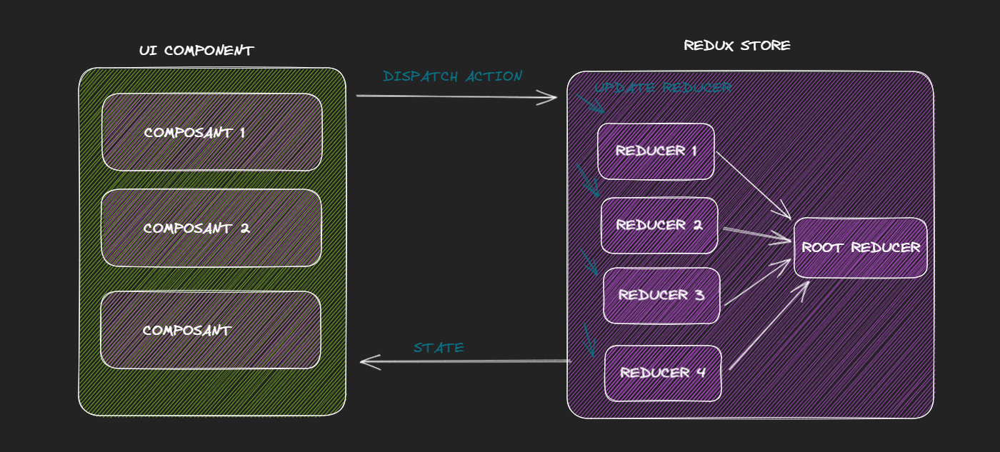

# Redux

Créez rapidement un document complet.

Redux est un cadre de gestion d'état pour les applications JavaScript. Il permet de stocker et de gérer l'état de l'application dans un seul magasin centralisé, plutôt que dans plusieurs composants individuels. Cela rend plus facile la gestion de l'état de l'application, en particulier dans les applications de grande envergure avec de nombreux composants interconnectés.

Le rôle de Redux est de fournir une structure claire et prévisible pour la gestion de l'état de l'application. Il utilise des concepts tels que les actions, les réducteurs et les états pour décrire comment l'état de l'application peut être modifié de manière déterministe. Cela signifie que pour un état donné de l'application et une action donnée, la même modification de l'état sera produite, ce qui aide à éviter les bugs difficiles à reproduire.

# Data Flow

---



- Redux va combiner les reducers en un seul
- Redux store envoi à la vue tout son état
- Les composant dispatch des actions qui vont mettre à jour les reducers correspondant

# Installation

---

```jsx
npm install redux
npm install react-redux
npm install redux-logger // facultatif
```

- Créer un dossier `store`
- Créer un fichier `store.js` dedans

```jsx
import {compose, createStore, applyMiddleware} from 'redux'
import logger from 'redux-logger'
import { rootReducer } from './rootReducer'
import thunk from 'redux-thunk'

// middleware -> code qui va s'executer avant q'une action se declenche
const middlewares = [logger, thunk]

const composedEnhancers = compose(applyMiddleware(...middlewares))

// RootReducer qui va combiner tout les reducers
export const store = createStore(rootReducer, composedEnhancers)
```

rootReducer 

```jsx
import { combineReducers } from "redux";
import { TodoReducer } from "./reducers/TodoReducer";

export const rootReducer = combineReducers({
  todo: TodoReducer ,
// tout les reducers 
})
```

# Reducer

---

Les reducers sont une partie importante de la programmation avec Redux, un cadre de gestion d'état pour les applications JavaScript. 

Les reducers sont des fonctions qui prennent en entrée l'état actuel de votre application et une action, et retournent un nouvel état pour votre application.

```jsx
state: { currentUser: null }, // etat complet
action : {
type: String,
payload: any // n'importe quel type et n'est pas requis 
}
```

Imaginez que vous tenez un registre pour un boulanger. Chaque jour, le boulanger ajoute ou retire des pains de différents types (pain de seigle, pain complet, etc.) de son stock.

 Vous devez tenir à jour les quantités de chaque type de pain pour vous assurer que le boulanger ne manque jamais de stock.

C'est là que les reducers entrent en jeu. Vous pouvez définir un reducer qui tient à jour les quantités de chaque type de pain en fonction des actions que le boulanger effectue. 

Par exemple, si le boulanger ajoute 10 pains de seigle, vous pouvez appeler le reducer avec l'action "AJOUTER_PAIN_SEIGLE" et une quantité de 10, et le reducer retournera un nouvel état de votre registre avec 10 pains de seigle de plus.

```jsx
const initialState = {
  painComplet: 50,
  painSeigle: 30,
};

function breadReducer(state = initialState, action) {
  switch (action.type) {
    case "AJOUTER_PAIN_SEIGLE":
      return {
        ...state,
        painSeigle: state.painSeigle + action.quantité,
      };
    case "RETIRER_PAIN_SEIGLE":
      return {
        ...state,
        painSeigle: state.painSeigle - action.quantité,
      };
    case "AJOUTER_PAIN_COMPLET":
      return {
        ...state,
        painComplet: state.painComplet + action.quantité,
      };
    case "RETIRER_PAIN_COMPLET":
      return {
        ...state,
        painComplet: state.painComplet - action.quantité,
      };
    default:
      return state;
  }
}
```

Vous pouvez voir que le reducer prend en entrée l'état actuel (ou **`initialState`**
 si aucun état n'a été défini) et une action, et retourne un nouvel état en fonction de l'action. Le reducer utilise un **`switch`**
 pour déterminer quelle action est en cours d'exécution et met à jour l'état en conséquence.

# Types

---

Les fichiers de types aident à documenter le code et à fournir une aide au codage en indiquant les types d'actions attendus et les types de données associées à chaque action.

```jsx
// todos/todoTypes.js
export const ADD_TODO = 'ADD_TODO';
export const TOGGLE_TODO = 'TOGGLE_TODO';
```

# Dispatch et Action

---

Les actions dans Redux sert à centraliser la définition des actions qui peuvent être déclenchées dans une application Redux. 

Les actions représentent des modifications à apporter à l'état de l'application et sont généralement déclenchées par des événements tels que des clics sur des boutons, des soumissions de formulaires, etc.

L'utilisation d'un fichier d'actions permet de séparer la logique de déclenchement des actions de la logique de mise à jour de l'état de l'application. 

Cela peut améliorer la lisibilité et la maintenabilité du code en permettant une définition claire des actions dans un seul endroit.

```jsx
// todos/todoAction.js
export function addTodo(text) {
  return {
    type: 'ADD_TODO',
    text
  };
}

export function toggleTodo(index) {
  return {
    type: 'TOGGLE_TODO',
    index
  };
}
```

**`dispatch`**
 fournie par le store Redux. Pour utiliser une action, vous devez d'abord l'importer depuis le fichier d'actions, puis l'utiliser en appelant la fonction **`dispatch`**
 et en passant l'objet d'action retourné par l'action en question en tant qu'argument.

```jsx
function TodoList({ todos, dispatch }) {
  const handleAddTodo = text => {
    dispatch(addTodo(text));
  };

  const handleToggleTodo = index => {
    dispatch(toggleTodo(index));
  };

  // reste du composant
}
```

ou on peut également utiliser le hook `useDispatch()` de redux

# Selector

---

`useSelector` est une hooks qui va extraire l’objet su store que l’on souhaite utilisé dans notre composant UI

```jsx
const loading = useSelector((state) => state>.product.loading )
```

Le `selector` va se mettre à jour a chaque fois que la valeur qu’il observe changera.

# Redux-Thunk

---

React Thunk est un middleware pour Redux qui permet d'exécuter des fonctions asynchrones dans une application Redux. 

Les fonctions asynchrones peuvent inclure des opérations telles que des requêtes API, des opérations de file d'attente ou des tâches de fond.

 

```jsx
npm install redux-thunk
```

Avec React Thunk, les actions peuvent retourner non seulement des objets d'action, mais également des fonctions asynchrones qui peuvent être utilisées pour déclencher des actions supplémentaires une fois qu'une opération asynchrone est terminée. 

Cela permet de mieux gérer les scénarios d'application dans lesquels des actions supplémentaires doivent être déclenchées en réponse à des opérations asynchrones.

```jsx
import axios from 'axios';

export function fetchTodos() {
  return async dispatch => {
    const response = await axios.get('/todos');
    dispatch({
      type: 'FETCH_TODOS_SUCCESS',
      todos: response.data
    });
  };
}
```

Il faut l’ajouter au store 

```jsx
import { createStore, applyMiddleware } from 'redux';
import thunk from 'redux-thunk';
import rootReducer from './reducers';

const store = createStore(rootReducer, applyMiddleware(thunk));
```

# Redux-Persist

---

React Persist permet de conserver un état grâce au `localStorage` cela signifie que même si j’actualise ma page, mon store gardera son dernier état

# UseSelector vs MapToState

---

It is difficult to say definitively which is "better" between **`useSelector`** and **`mapStateToProps`**, as they are used for different purposes and the appropriate choice will depend on your specific use case.

**`useSelector`** is a hook that allows you to retrieve values from the Redux store within a functional component, while **`mapStateToProps`** is a function that is used to specify which pieces of state should be passed to a component as props when using the **`connect`** function from React-Redux.

If you are using functional components and want an easy way to retrieve values from the Redux store, **`useSelector`** may be the better choice. If you are using class-based components and want to specify which pieces of state should be passed to a component as props, **`mapStateToProps`** may be the better choice.

Ultimately, the choice between **`useSelector`** and **`mapStateToProps`** will depend on your specific use case and the needs of your application.

### Counter Exemple :

UseSelector :

```jsx
import { createStore } from 'redux';

const initialState = {
count: 0
};

function reducer(state = initialState, action) {
switch (action.type) {
case 'INCREMENT':
return {
count: state.count + 1
};
case 'DECREMENT':
return {
count: state.count - 1
};
default:
return state;
}
}

const store = createStore(reducer);
```

```jsx
import React from 'react';
import { useSelector, useDispatch } from 'react-redux';

function Counter() {
  const count = useSelector(state => state.count);
  const dispatch = useDispatch();

  function increment() {
    dispatch({ type: 'INCREMENT' });
  }

  function decrement() {
    dispatch({ type: 'DECREMENT' });
  }

  return (
    <div>
      <p>Current count: {count}</p>
      <button onClick={increment}>Increment</button>
      <button onClick={decrement}>Decrement</button>
    </div>
  );
}
```

MapToState :

```jsx
import { createStore } from 'redux';
import { connect } from 'react-redux';

const initialState = {
  count: 0
};

function reducer(state = initialState, action) {
  switch (action.type) {
    case 'INCREMENT':
      return {
        count: state.count + 1
      };
    case 'DECREMENT':
      return {
        count: state.count - 1
      };
    default:
      return state;
  }
}

const store = createStore(reducer);

function mapStateToProps(state) {
  return {
    count: state.count
  };
}

function mapDispatchToProps(dispatch) {
  return {
    increment: () => dispatch({ type: 'INCREMENT' }),
    decrement: () => dispatch({ type: 'DECREMENT' })
  };
}

function Counter(props) {
  return (
    <div>
      <p>Current count: {props.count}</p>
      <button onClick={props.increment}>Increment</button>
      <button onClick={props.decrement}>Decrement</button>
    </div>
  );
}

const ConnectedCounter = connect(mapStateToProps, mapDispatchToProps)(Counter);
```